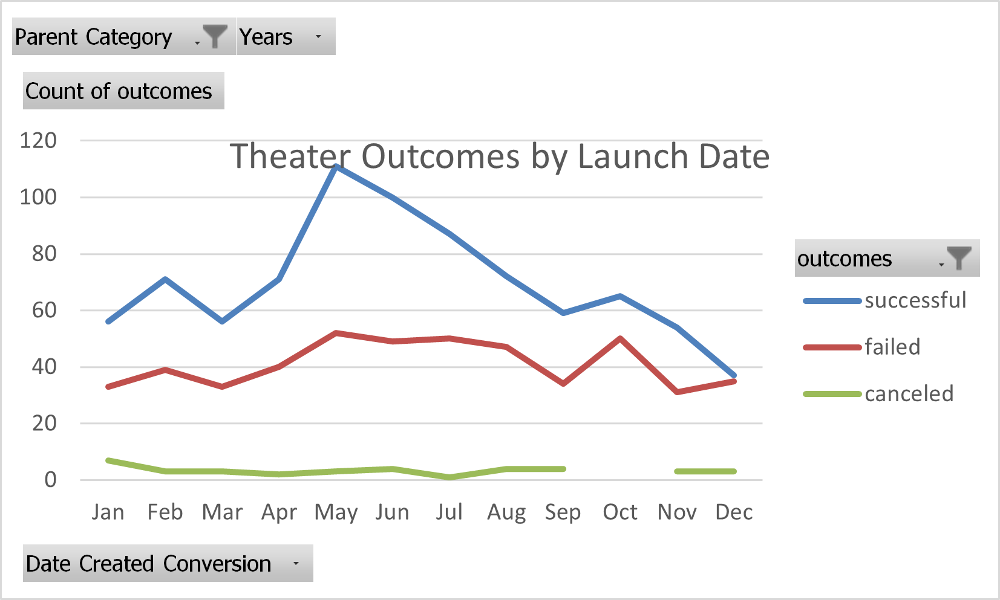
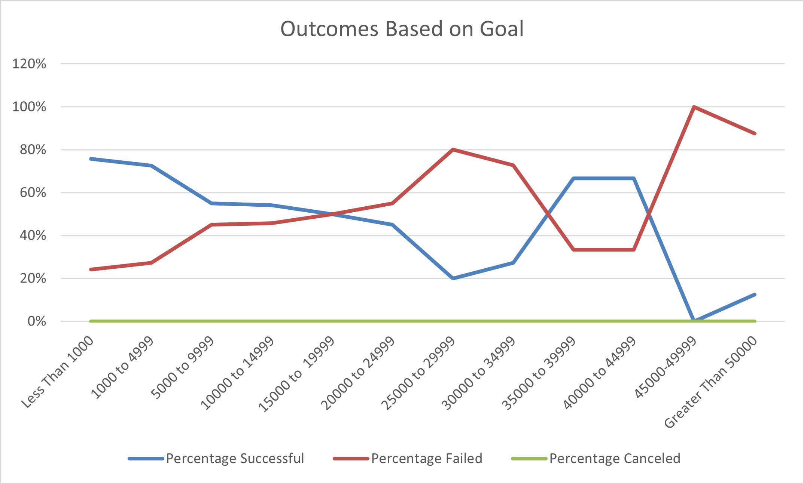

# Kickstarting with Excel

## Overview of Project
Louise is looking to start a Kickstater to fund her play Fever. A dataset of over 4000 fundraising campaigns were examined to help Louise make important decisions for a successful and realistic crowd funding plan. The data was filtered to only include the plays subcategory. Outcomes, goals, and pledges were examined to find correlations between the variable. Launches and end dates were also reviewed to determine is the duration of the fundraiser had an effect on the outcome.

### Purpose
This data analysis was used to help Louise make important decisions about her Kickstarter campaign to fund her play Fever.

## Analysis and Challenges

### Analysis of Outcomes Based on Launch Date
 
A significant spike in the number of successful kickstart campaigns occured in the month of May and gradually dropped througout the remaing summer months. The fall and winter months saw fewer success counts than the beginning of the year as well. The failed campaigns remained stable throughout the year. There was a gradual increase in the summer months. September saw a decrease in failed campaigns only to be followed by a spike in the month of October. Canceled campaigns remained low, with none reported in October.

### Analysis of Outcomes Based on Goals
 
Generally the Kickstartes with smaller goal amounts had higher success rates, with those between $1,000 and $5000 having the most. They also had the highest number of failed campaigns relatively. There were not many projects with goals of higher than $20,000. It should be noted that the average goal of successful campaigns was $5,049.

### Challenges and Difficulties Encountered
I ran into some issues with the =COUNTIF formula mainly due to syntax. I double checked my numbers by filtering on the Kickstarter sheet, and if they did not match my =COUNTIF numbers I reviewed my syntax and argument numbers to get the correct numbers.

## Results

- What are two conclusions you can draw about the Outcomes based on Launch Date?  Campaigns tend to be more successful in the summer months starting in May. Campaigns tend to be less successfuil in the fall and winter months.

- What can you conclude about the Outcomes based on Goals?  Plays with goals between $1000 and $5000 have the highest number of successful Kickstarters.

- What are some limitations of this dataset?   A larger sample size could be more beneficial for our analysis and we could analyze a variety of crowdsourcing companies to draw more significant insights.

- What are some other possible tables and/or graphs that we could create? The correlation between Country and Outcome could be discovered further. Wealthier countries could view plays as important to society and culture, while others could find it wasteful.
